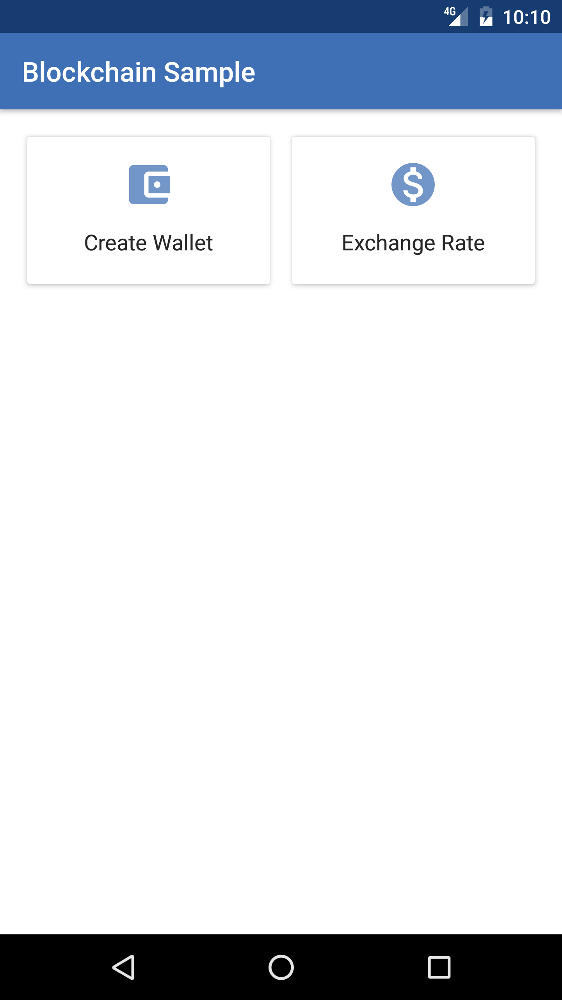
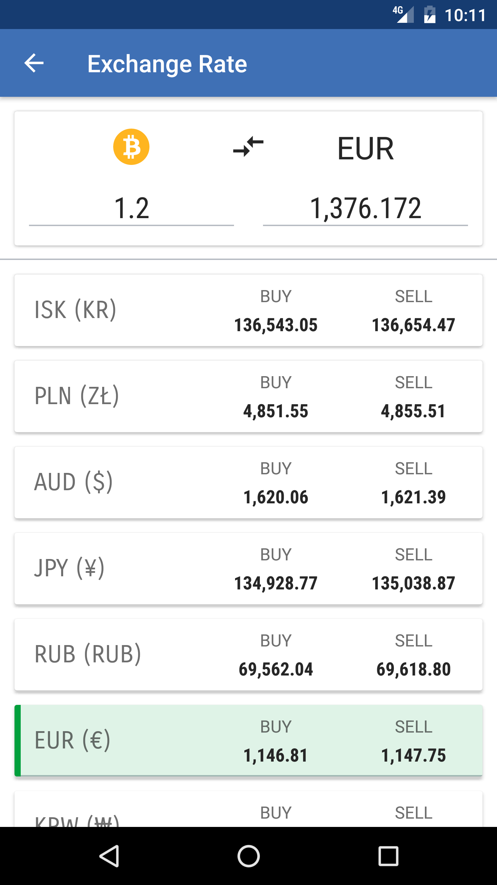
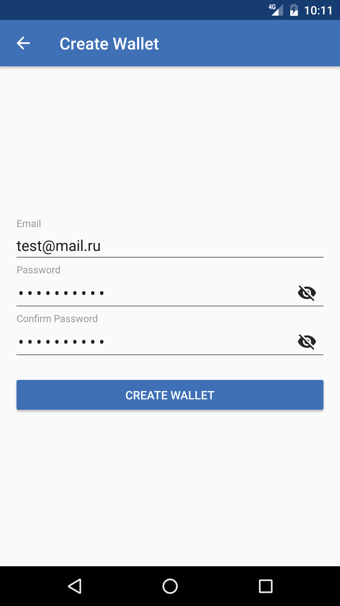

## Blockchain Sample

Sample application of using the <a href="https://blockchain.info/api">Blockchain API</a> (MVP architecture).

# Functionality

Application contains two functions: 
* Create wallet in service
* Exchange rates for Bitcoin

# Screenshots
&nbsp;
&nbsp;


# Service Information
Instruction of the installing API service: https://github.com/blockchain/service-my-wallet-v3#installation

In class `Constants` type your API key:
``` */
   public abstract class Constants {
       public static final String API_KEY = "YOUR-API-KEY";
   }
```

App using <a href="https://github.com/blockchain/api-v1-client-java">java</a> library from Blockchain.

In `build.gradle`:
```
    dependencies {
        compile 'info.blockchain:api:1.1.4'
    }
```

Example use methods from it library .All methods in main thread. For background thread used Rx:

#### Create Wallet
```
    Observable<CreateWalletResponse> createWallet(String email, String password) {
        return Observable.fromCallable(() -> CreateWallet.create(
                    Constants.BASE_URL,
                    password,
                    Constants.API_KEY,
                    null, null,
                    email))
                .observeOn(AndroidSchedulers.mainThread())
                .subscribeOn(Schedulers.newThread());
    }
```

#### Exchange Rates
```
    Observable<Map<String, Currency>> getExchangeRates() {
        return Observable.fromCallable(() -> ExchangeRates.getTicker(Constants.API_KEY))
                .observeOn(AndroidSchedulers.mainThread())
                .subscribeOn(Schedulers.newThread());
    }
```

For get access need API key.
* Receive Payments API V2: https://api.blockchain.info/v2/apikey/request
* Global key (available Create Wallet,... etc): https://blockchain.info/ru/api/api_create_code

# Developers

* [Michael Soyma](https://github.com/klonaria)
